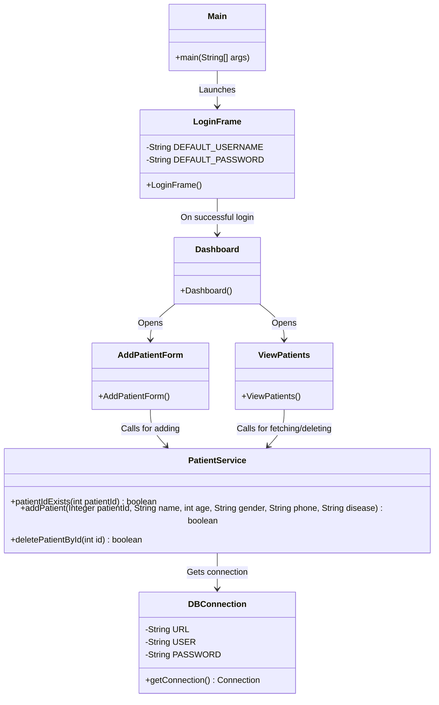
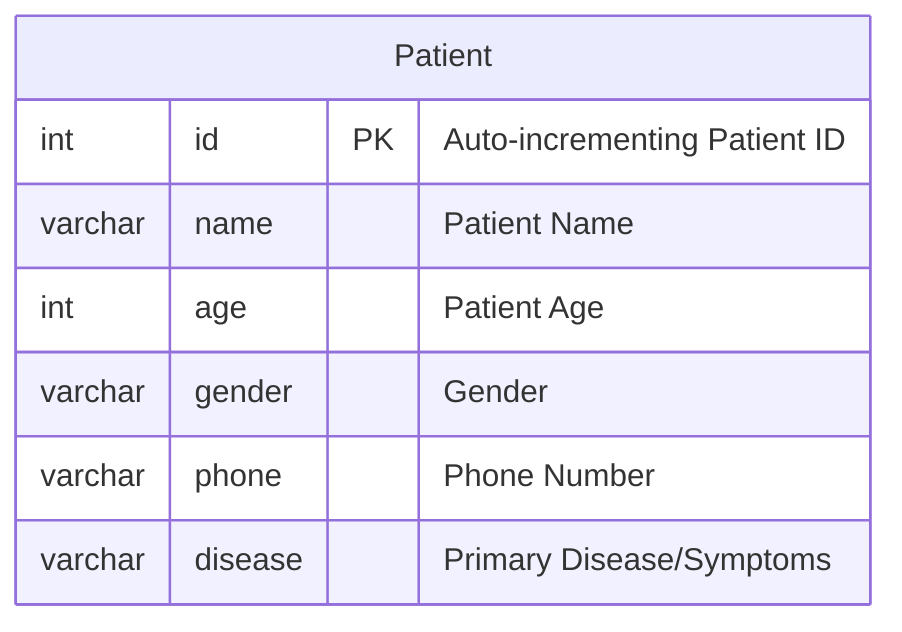

# Patient Record System Diagrams

## 1. Class Diagram (UML)
This diagram illustrates the Model-View-Controller/Service architecture of the Patient Record System.

## 2. Database Entity-Relationship Diagram
This ER diagram shows the tables and relationships in the database used by the system.

